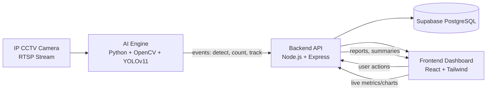

# NutriDelight Smart CCTV Analytics

## 1. Project Vision
Build a real-world AI video analytics platform for NutriDelight that connects to a live IP CCTV camera via RTSP, detects people and vehicles in real time, tracks customer movement, and turns the stream into business metrics the shop owner can use.

## 2. Technology Choices

### Frontend: React + Tailwind CSS
React is a strong fit for a dashboard-heavy product because it supports reusable UI components, fast state updates, and clean integration with live analytics. Tailwind CSS is chosen so the UI can be built quickly with consistent spacing, responsive layouts, and a modern startup-style design system without heavy custom CSS overhead.

### Backend: Node.js + Express.js
Node.js is a good choice for real-time API orchestration, camera session management, websocket/event streaming, and report delivery. Express.js keeps the backend lightweight and easy to extend as modules grow from MVP to production.

### AI Engine: Python + OpenCV + YOLOv11
Python is the practical standard for computer vision workflows and model integration. OpenCV handles RTSP frame capture and pre/post-processing, while YOLOv11 provides modern object detection for people and vehicle classes with strong real-time performance.

### Database: Supabase
Supabase is selected for managed PostgreSQL storage, auth readiness, real-time features, and easy querying for analytics. It is a good fit for storing structured counts, events, session summaries, and report history.

## 3. Proposed Software Architecture

### High-Level Design
The system should be split into four cooperating layers:
- Frontend dashboard for live view, charts, reports, and admin controls.
- Backend API for orchestration, authentication, aggregation, and report generation.
- AI engine for stream ingestion, detection, tracking, counting, and event emission.
- Database for persistent analytics, audit history, and daily/hourly summaries.

### Core Runtime Flow
1. The frontend requests camera status, live metrics, and report data from the backend.
2. The backend requests analytics updates from the AI engine or consumes pushed events.
3. The AI engine reads RTSP frames, detects objects, tracks movement, and emits structured events.
4. The backend aggregates these events into customer counts, traffic density, and time-based summaries.
5. The backend writes historical data into Supabase and serves it back to the frontend.

## 4. Folder Responsibilities

### /frontend
Responsible for the React dashboard, charts, live stream panels, camera controls, report screens, and responsive UI components.

### /backend
Responsible for REST APIs, auth/session logic, analytics aggregation, websocket support, report endpoints, and integration with Supabase and the AI engine.

### /ai-engine
Responsible for RTSP ingestion, frame processing, detection, tracking, entry/exit logic, vehicle classification, and event emission.

### /database
Responsible for schema design, migration planning, seed data, analytics query definitions, and database documentation.

### /assets
Responsible for images, icons, branding, mock visuals, and any static reference material used by the UI or documentation.

### /docs
Responsible for architecture notes, API specs, runbooks, setup guides, and product documentation.

### /prompts
Responsible for AI prompts, prompt templates, evaluation prompts, and model behavior instructions if any LLM-assisted features are later added.

### /testing
Responsible for backend tests, AI-engine validation scripts, integration checks, and sample payloads or fixtures.

## 5. Module Communication Diagram

## 6. Database Planning

### Suggested Tables
- cameras: camera profile, RTSP URL reference, location, status, notes.
- detection_events: raw AI events such as person entered, person exited, vehicle detected.
- customer_sessions: customer entry/exit totals and inside count over time.
- vehicle_counts: per-type vehicle counts aggregated by time window.
- hourly_analytics: hourly summaries for footfall and traffic.
- daily_analytics: daily summaries for business reporting.
- reports: generated report metadata, file paths, and generated timestamps.
- audit_logs: system actions, failures, reconnects, and admin operations.

### Data Strategy
- Store raw events for traceability.
- Store hourly and daily aggregates for fast dashboard loads.
- Keep camera configuration separate from analytics history.
- Use timestamps consistently in UTC and convert only at presentation time.

## 7. API Planning

### Core API Groups
- Camera APIs: register camera, test RTSP, get stream status, reconnect camera.
- Live Analytics APIs: current people inside, entry count, exit count, vehicle counts, traffic density.
- History APIs: hourly summaries, daily summaries, date range filters.
- Reporting APIs: generate report, list reports, download report.
- Admin APIs: health check, reset counters, diagnostics, audit logs.

### Recommended REST Endpoints
- GET /api/health
- GET /api/cameras
- POST /api/cameras/test-stream
- GET /api/analytics/live
- GET /api/analytics/hourly
- GET /api/analytics/daily
- GET /api/vehicles/summary
- POST /api/reports/generate
- GET /api/reports
- GET /api/reports/:id

### Event Contract Between AI Engine and Backend
The AI engine should emit structured JSON events with fields like:
- event_type
- timestamp
- camera_id
- object_class
- direction
- confidence
- track_id
- frame_source

## 8. Development Roadmap

### Phase 1: Architecture and Foundation
- Confirm camera assumptions and deployment constraints.
- Finalize schema, API contract, and event format.
- Define UI wireframe sections and navigation structure.

### Phase 2: Stream and Detection MVP
- Connect one RTSP camera.
- Show live stream in the frontend.
- Detect people and vehicles in the AI engine.
- Emit live detection events to the backend.

### Phase 3: Counting and Analytics
- Add entry and exit counting logic.
- Track current people inside the shop.
- Build vehicle-type counters and traffic density classification.
- Persist hourly and daily aggregates.

### Phase 4: Dashboard and Reporting
- Build charts, tables, KPI cards, and camera status widgets.
- Add report generation and export workflows.
- Add filters for time range and camera selection.

### Phase 5: Hardening and Testing
- Add integration tests and sample payload fixtures.
- Improve reconnection handling and stream failure recovery.
- Validate performance, accuracy, and alerting.

## 9. Build Strategy
This project should be developed in small, testable modules:
- Start with RTSP ingestion and live preview.
- Add detection events next.
- Add counting and aggregation after that.
- Finish with dashboard polish and reporting.

## 10. Approval Gate
No implementation code should be generated until the architecture, data model, API contract, and UI scope are approved.
